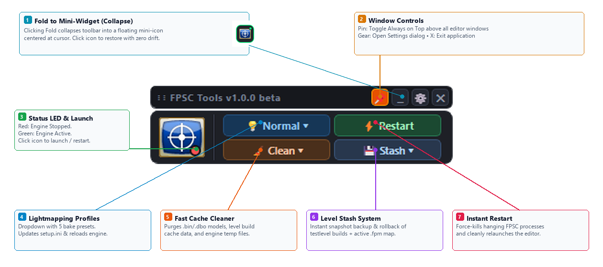
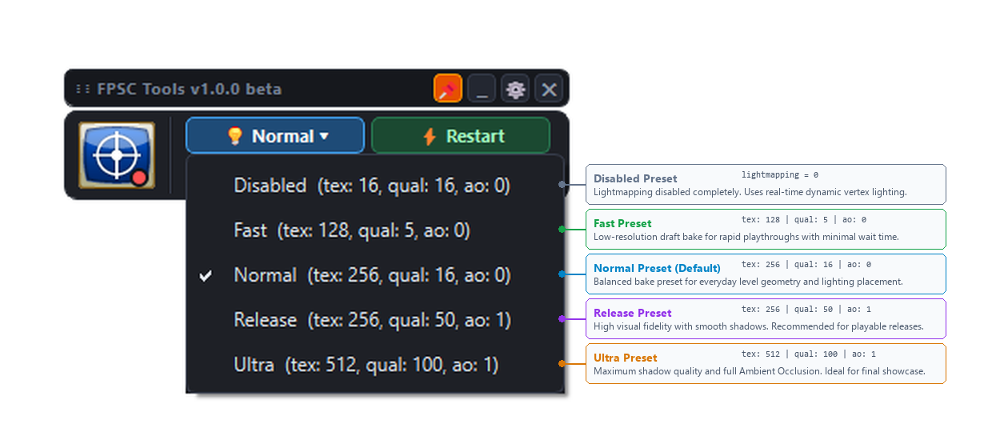
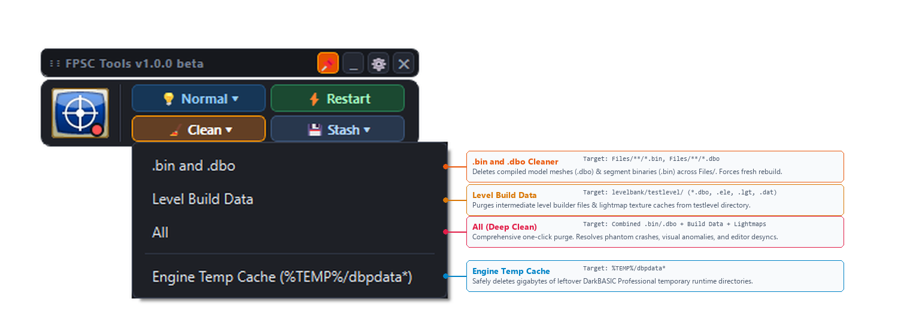
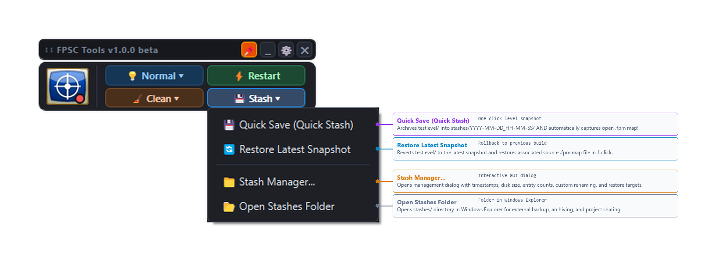

# 🛠️ FPSC Tools (v1.0.0 beta)

> **Floating toolbar for FPS Creator development**  
> *(Created in support of the BIMA / Black Ice Mod project)*


---

## About the Project

**FPSC Tools** is a companion utility and floating toolbar designed for the **FPS Creator (especially Black Ice Mod Advanced)** engine, developed by **Madness Studio**.

The tool streamlines and accelerates everyday FPS Creator development workflows by solving our common pains:
- **Lightmapping presets switching**: You hate long build times but... too lazy to change lightmapping settings manually every time? Toolbar provides you with one-button switch between lightmapping and bake quality presets.
- **DBO and BIN cleaning**: OFC, it automates cleaning of compiled models (`.dbo`), segment binaries (`.bin`), and - if you want - intermediate level build data (`.dbo`, `.ele`, `.lgt`, `.dat`).
- **Temp files cleaning**: FPSC floods your TEMP with data. This panel safely purges gigabytes of temporary `dbpdata*` working directories left behind in `%TEMP%`.
- **Level Snapshot Management)**: Provides one-click backup and restoration of `Files/levelbank/testlevel` builds, while automatically parsing and preserving the active editor map file (`.fpm`). **Highly experimental!**

---

## Key Features

### 🪟 Floating Toolbar & Mini-Widget


- **Always-on-Top**: Stays above your workspace, by default in bottom-right corner of your screen.
- **Folding and unfolding**: Pressing `🗕` collapses the toolbar into a mini button; clicking to expand returns the toolbar.
- **Real-Time Engine LED Indicator**: An active visual indicator tracks whether FPS Creator processes are running or stopped.
- **System Tray Integration**: Full background presence with tray menu and native toast notifications.
- **English and Russian localization**: Both languages available.

---

### 1. On-the-Fly Lightmapping Profiles


Switch between 5 tuned lightmapping profiles via a single click with instant `setup.ini` updates and automatic engine reload:
| Profile | `lightmapping` | `lightmaptexsize` | `lightmapquality` | `lightao` | Description |
| :--- | :---: | :---: | :---: | :---: | :--- |
| **Ultra** | `1` | `512` | `100` | `1` | Maximum shadow resolution and full Ambient Occlusion |
| **Release** | `1` | `256` | `50` | `1` | High visual fidelity suitable for final production builds |
| **Normal** | `1` | `256` | `16` | `0` | Balanced preset for day-to-day level building |
| **Fast** | `1` | `128` | `5` | `0` | Quick draft testing with near-instant bakes |
| **Disabled** | `0` | `16` | `16` | `0` | Lightmapping disabled |

*All profile values can be customized to your preference in the Settings dialog (`⚙`).*

---

### 2. Fast Cache Cleaner


1. **`.bin and .dbo`**: Fast recursive deletion of cached models and segment binaries throughout `Files/`.
2. **`Level Build Data`**: Removes intermediate build files (`.dbo`, `.ele`, `.lgt`, `.dat`) from `Files/levelbank/testlevel/` and `lightmaps/`.
3. **`All`**: One-click deep purge combining `.bin`/`.dbo`, level build data, and lightmap textures.
4. **`Engine Temp Cache (%TEMP%/dbpdata*)`**: Safely clears leftover DarkBASIC Professional engine runtime directories.

---

### 3. Level Stash System with Map (`.fpm`) Preservation


> ⚠️ **WARNING**: This feature is experimental, use at your own risk!

- **Automatic Map Detection**: Queries the FPS Creator editor window title via Win32 API (`FPS Creator - [mapbank\level1.fpm]`) to archive the corresponding source `.fpm` alongside the compiled `testlevel` contents.
- **Quick Stash & Quick Restore**: Save and revert snapshots in a single click.
- **Visual Stash Manager**: Tabular view displaying snapshot dates, sizes, file counts, and associated map paths.

---

## Building from Source

### Prerequisites
- **OS**: Windows 7 / 8 / 10 / 11 (32-bit or 64-bit)
- **Qt Framework**: Qt 5.15.2 (MinGW 8.1.0 32-bit)
- **Compiler**: MinGW 8.1.0 (32-bit)

### Automated Build & Package
You could use Qt Creator with default pro-file for regular build... or just run the packaging batch script from the repository root:
```cmd
build_and_package.bat
```
The script will:
1. Compile translations: `fpsc_tool_ru.ts` $\rightarrow$ `fpsc_tool_ru.qm`.
2. Generate Makefiles with `qmake`.
3. Build the core Qt application binary (`FPSC_Tools_app.exe`) via `mingw32-make -j4`.
4. Bundle runtime libraries and plugins into `payload.bin` (via native PowerShell).
5. Compile the static single-file launcher and produce the final standalone `dist\FPSC_Tools.exe`.

---

## Single-File Standalone Architecture

**FPSC Tools** is distributed as a **single, standalone executable** (`FPSC_Tools.exe`) requiring **zero external DLLs**. Of course you still can build a regular multi-file version, but... we don't want to clutter poor-old FPSC directory, do we? :)

### How It Works:
```text
dist/FPSC_Tools.exe (Single Portable Binary)
│
├── Native Win32 Launcher Stub (C++11, statically linked, 0 non-system dependencies)
└── Embedded Binary Payload (IDR_PAYLOAD resource)
    ├── FPSC_Tools_app.exe (Qt 5.15.2 application binary)
    ├── Qt5Core.dll, Qt5Gui.dll, Qt5Widgets.dll, Qt5Concurrent.dll
    ├── MinGW runtime (libgcc, libstdc++, libwinpthread)
    └── Qt plugins (platforms/qwindows.dll, styles/, imageformats/)
```

1. **Self-Contained Launcher**: The outer binary is compiled with `-static -static-libgcc -static-libstdc++`, linking only to core Windows APIs (`KERNEL32.dll`, `USER32.dll`, `msvcrt.dll`).
2. **Memory Extraction & Verification**: On launch, the stub checks `%LOCALAPPDATA%\FPSC_Tools\runtime_v100_beta\`. If not already extracted (or if updated), it unpacks the embedded payload directly from memory in ~30 milliseconds.
3. **Instant Cached Launches**: Subsequent launches detect the matching version stamp and launch immediately (< 2 ms) without re-extracting.
4. **Seamless Process Execution**: Configures `SetDllDirectoryW` and environment `PATH`, preserving the user's working directory and transparently forwarding all command-line arguments.

---

## Repository Structure

```text
FPSC_Tools/
├── build_and_package.bat       # Automated single-file build & packaging pipeline
├── README.md                   # Project documentation
├── .gitignore                  # Git rules for build and temp file exclusions
└── src/
    ├── src.pro                 # Qt qmake project file
    ├── app.rc                  # Windows executable resource & metadata
    ├── resources.qrc           # Qt embedded resources (icons, translations)
    ├── main.cpp                # Application entry point
    ├── launcher/
    │   ├── main_launcher.cpp   # Native Win32 single-file bootstrap launcher
    │   └── launcher.rc         # Resource script embedding payload.bin
    ├── core/
    │   ├── AppController.*     # Main application coordination controller
    │   ├── ConfigManager.*     # Persistent settings manager (fpsc_tool.ini)
    │   ├── FastCleaner.*       # Cache & temp file cleaning engine
    │   ├── I18n.*              # Internationalization & dictionary registry
    │   ├── ProcessController.* # Win32 process management for FPS Creator
    │   ├── SetupIniManager.*   # Parser and modifier for setup.ini
    │   └── StashManager.*      # Level snapshot creation and restoration
    ├── ui/
    │   ├── FloatingToolbar.*   # Main floating action toolbar
    │   ├── MiniIconWidget.*    # Collapsible floating mini-widget
    │   ├── TrayManager.*       # Windows system tray manager
    │   ├── SettingsDialog.*    # Configuration dialog
    │   ├── StashDialog.*       # Level stash management dialog
    │   ├── LightMapperProgressDialog.* # External process progress indicator
    │   └── Theme.h             # Dark UI styling and QSS theme definitions
    └── translations/
        ├── fpsc_tool_ru.ts     # Qt Linguist Russian source translation
        └── fpsc_tool_ru.qm     # Compiled binary translation file
```

---

## Credits & Attribution

- **Developer**: Ivan Klenov (aka Navy LiK, aka Wolf4D)
- **Company / Studio**: [Madness Studio](https://madnesstudio.ru)
- **Project Support**: Created in support of the **Black Ice Mod (BIMA)** project

---

## License

This project is licensed under the **MIT License**.

```text
MIT License

Copyright (c) 2026 Ivan Klenov (aka Navy LiK) / Madness Studio

Permission is hereby granted, free of charge, to any person obtaining a copy
of this software and associated documentation files (the "Software"), to deal
in the Software without restriction, including without limitation the rights
to use, copy, modify, merge, publish, distribute, sublicense, and/or sell
copies of the Software, and to permit persons to whom the Software is
furnished to do so, subject to the following conditions:

The above copyright notice and this permission notice shall be included in all
copies or substantial portions of the Software.

THE SOFTWARE IS PROVIDED "AS IS", WITHOUT WARRANTY OF ANY KIND, EXPRESS OR
IMPLIED, INCLUDING BUT NOT LIMITED TO THE WARRANTIES OF MERCHANTABILITY,
FITNESS FOR A PARTICULAR PURPOSE AND NONINFRINGEMENT. IN NO EVENT SHALL THE
AUTHORS OR COPYRIGHT HOLDERS BE LIABLE FOR ANY CLAIM, DAMAGES OR OTHER
LIABILITY, WHETHER IN AN ACTION OF CONTRACT, TORT OR OTHERWISE, ARISING FROM,
OUT OF OR IN CONNECTION WITH THE SOFTWARE OR THE USE OR OTHER DEALINGS IN THE
SOFTWARE.
```

